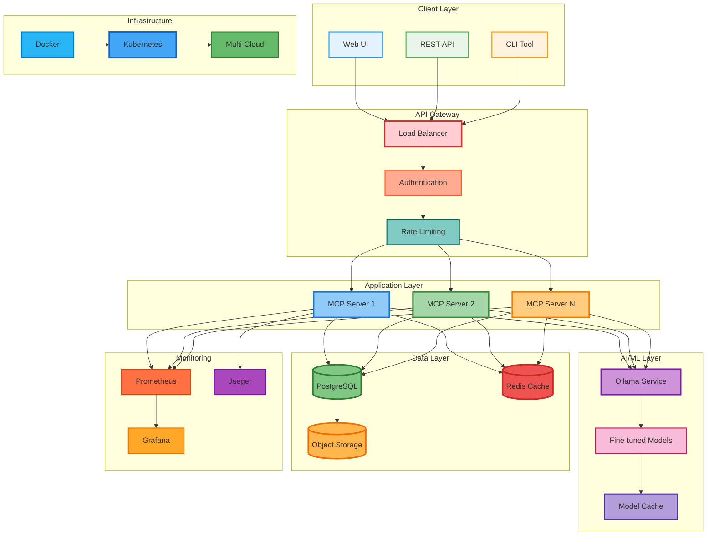

# InfraGenius - AI-Powered DevOps & SRE Intelligence Platform

[](https://opensource.org/licenses/MIT)
[](https://docker.com)
[](https://kubernetes.io)
[](https://github.com)

## 🎯 Overview

**InfraGenius** is a comprehensive AI-powered platform designed specifically for DevOps, SRE, Cloud, and Platform Engineering professionals. It provides industry-level expertise through advanced AI models, optimized for infrastructure operations, reliability engineering, and cloud architecture.

### 🌟 Key Features

- 🤖 **AI-Powered Analysis**: Advanced DevOps/SRE expertise using fine-tuned models
- ⚡ **High Performance**: Sub-second response times with intelligent caching
- 🔒 **Enterprise Security**: JWT authentication, rate limiting, and compliance ready
- 📊 **Complete Observability**: Prometheus metrics, Grafana dashboards, distributed tracing
- 🚀 **Auto-Scaling**: Kubernetes-native with HPA and resource optimization
- 🌍 **Multi-Cloud Ready**: Deploy on AWS, GCP, Azure, or on-premises
- 🔧 **One-Click Deployment**: Automated setup for any environment

## 🏗️ Architecture Overview




## 📁 Project Structure

```
InfraGenius/
├── 📁 environments/           # Environment-specific configurations
│   ├── 📁 test/              # Test environment configs
│   ├── 📁 staging/           # Staging environment configs
│   └── 📁 production/        # Production environment configs
├── 📁 src/                   # Source code
│   ├── 📁 core/              # Core application logic
│   ├── 📁 plugins/           # Extensible plugins
│   └── 📁 ui/                # Web interface
├── 📁 docker/                # Docker configurations
│   ├── 📁 development/       # Development containers
│   └── 📁 production/        # Production containers
├── 📁 kubernetes/            # K8s manifests
│   ├── 📁 test/              # Test cluster configs
│   ├── 📁 staging/           # Staging cluster configs
│   └── 📁 production/        # Production cluster configs
├── 📁 docs/                  # Documentation
│   ├── 📁 architecture/      # Architecture diagrams
│   ├── 📁 api/               # API documentation
│   └── 📁 deployment/        # Deployment guides
├── 📁 tests/                 # Test suites
│   ├── 📁 unit/              # Unit tests
│   ├── 📁 integration/       # Integration tests
│   └── 📁 e2e/               # End-to-end tests
├── 📁 scripts/               # Automation scripts
│   ├── 📁 setup/             # Setup and installation
│   ├── 📁 deploy/            # Deployment automation
│   └── 📁 utils/             # Utility scripts
├── 📁 monitoring/            # Monitoring configurations
│   ├── 📁 grafana/           # Grafana dashboards
│   └── 📁 prometheus/        # Prometheus configs
├── 📁 security/              # Security configurations
├── 📁 backup/                # Backup and recovery
├── 📁 migrations/            # Database migrations
├── 📁 examples/              # Usage examples
├── 📁 tools/                 # Development tools
└── 📄 README.md              # This file
```

## 🚀 Quick Start

### One-Click Local Setup

```bash
# Clone the repository
git clone https://github.com/your-org/infragenius.git
cd infragenius

# One-click setup (auto-detects your system)
./scripts/setup/quick-start.sh

# Access your local instance
open http://localhost:8080
```

### Docker Deployment

```bash
# Development environment
docker-compose -f docker/development/docker-compose.yml up

# Production environment
docker-compose -f docker/production/docker-compose.yml up
```

### Kubernetes Deployment

```bash
# Test environment
kubectl apply -f kubernetes/test/

# Staging environment
kubectl apply -f kubernetes/staging/

# Production environment
kubectl apply -f kubernetes/production/
```

## 💰 Pricing & Versions

### 🆓 Open Source Version (FREE)

**Perfect for individual developers and small teams**

- ✅ Core DevOps/SRE AI analysis
- ✅ Basic monitoring and metrics
- ✅ Community support
- ✅ Self-hosted deployment
- ✅ Up to 100 requests/month
- ✅ Standard response time
- ✅ Basic integrations

```bash
# Deploy open source version
./scripts/setup/deploy-open-source.sh
```

### 💎 Professional Version ($10/month)

**Enhanced features for growing teams**

- ✅ **Everything in Open Source**
- 🚀 **Unlimited requests**
- ⚡ **Priority processing** (2x faster)
- 📊 **Advanced analytics** and reporting
- 🔧 **Premium integrations** (Slack, Teams, PagerDuty)
- 🎯 **Custom fine-tuning** for your infrastructure
- 📞 **Email support** (24h response)
- 🔒 **Advanced security** features
- 📈 **Performance optimization** tools
- 🌍 **Multi-region** deployment support

```bash
# Deploy professional version
./scripts/setup/deploy-professional.sh --license-key=YOUR_KEY
```

### 🏢 Enterprise Version (Custom Pricing)

**Full-scale enterprise deployment**

- ✅ **Everything in Professional**
- 🏢 **On-premises deployment**
- 🔐 **SSO integration** (SAML, OIDC)
- 📞 **Dedicated support** (4h SLA)
- 🎨 **Custom branding**
- 📋 **Compliance** (SOC2, HIPAA, PCI-DSS)
- 🔧 **Custom integrations**
- 📊 **Executive dashboards**
- 🚀 **Dedicated infrastructure**

[Contact Sales](mailto:sales@devops-mcp.com) for enterprise pricing.

## 🌍 Environment Management

### Test Environment
- **Purpose**: Development and testing
- **Resources**: Minimal (1 CPU, 2GB RAM)
- **Data**: Synthetic test data
- **Monitoring**: Basic metrics

```bash
./scripts/deploy/deploy-test.sh
```

### Staging Environment
- **Purpose**: Pre-production validation
- **Resources**: Production-like (2 CPU, 4GB RAM)
- **Data**: Anonymized production data
- **Monitoring**: Full observability stack

```bash
./scripts/deploy/deploy-staging.sh
```

### Production Environment
- **Purpose**: Live customer traffic
- **Resources**: Auto-scaling (2-20 instances)
- **Data**: Live production data
- **Monitoring**: Enterprise monitoring + alerting

```bash
./scripts/deploy/deploy-production.sh
```

## 🛠️ Core Features

### 🤖 AI-Powered DevOps Analysis

```python
# Example API usage
import requests

response = requests.post('http://localhost:8080/analyze', {
    "prompt": "My Kubernetes pods are crashing with OOMKilled errors",
    "domain": "devops",
    "context": "Production cluster with 100+ microservices"
})

print(response.json())
# Returns detailed analysis with:
# - Root cause identification
# - Step-by-step resolution
# - Prevention strategies
# - Best practices
```

### 📊 Comprehensive Domains

| Domain | Features | Use Cases |
|--------|----------|-----------|
| **DevOps** | CI/CD, IaC, Automation | Pipeline optimization, deployment strategies |
| **SRE** | Reliability, Incidents, SLOs | Incident response, reliability improvements |
| **Cloud** | Architecture, Security, Cost | Cloud migration, cost optimization |
| **Platform** | Developer Experience, APIs | Platform design, developer productivity |

### ⚡ Performance Features

- **Sub-second response times** with intelligent caching
- **Auto-scaling** based on demand (2-100 instances)
- **Multi-level caching** (Redis + in-memory)
- **Connection pooling** for optimal resource usage
- **Async processing** for high throughput
- **Response streaming** for large analyses

### 🔒 Enterprise Security

- **JWT authentication** with refresh tokens
- **Role-based access control** (RBAC)
- **Rate limiting** by user tier
- **API key management**
- **Audit logging** for compliance
- **Data encryption** at rest and in transit
- **Network security** with VPC and firewalls

## 📊 Monitoring & Observability

### Metrics & Dashboards
- **Prometheus** metrics collection
- **Grafana** dashboards and visualization
- **Application performance** monitoring
- **Infrastructure** monitoring
- **Business metrics** tracking
- **Custom alerts** and notifications

### Health Checks
```bash
# System health
curl http://localhost:8080/health

# Detailed health check
curl http://localhost:8080/health/detailed

# Metrics endpoint
curl http://localhost:8080/metrics
```

## 🔧 Dependencies

### Core Dependencies
```json
{
  "runtime": {
    "python": ">=3.11",
    "docker": ">=20.10",
    "kubernetes": ">=1.24"
  },
  "databases": {
    "postgresql": ">=15",
    "redis": ">=7.0"
  },
  "ai_models": {
    "ollama": ">=0.1.0",
    "gpt-oss": "latest"
  },
  "monitoring": {
    "prometheus": ">=2.40",
    "grafana": ">=9.0"
  }
}
```

### System Requirements

| Component | Minimum | Recommended | Production |
|-----------|---------|-------------|------------|
| **CPU** | 2 cores | 4 cores | 8+ cores |
| **Memory** | 4GB | 8GB | 16+ GB |
| **Storage** | 20GB | 50GB | 100+ GB |
| **Network** | 1Mbps | 10Mbps | 100+ Mbps |

## 🚀 Deployment Options

### Local Development
```bash
# Quick start for development
./scripts/setup/local-dev.sh

# With monitoring stack
./scripts/setup/local-dev.sh --monitoring

# With sample data
./scripts/setup/local-dev.sh --sample-data
```

### Cloud Deployment

#### AWS
```bash
./scripts/deploy/aws-deploy.sh \
  --region us-east-1 \
  --environment production \
  --instance-type t3.large
```

#### Google Cloud
```bash
./scripts/deploy/gcp-deploy.sh \
  --region us-central1 \
  --environment production \
  --machine-type e2-standard-4
```

#### Azure
```bash
./scripts/deploy/azure-deploy.sh \
  --region eastus \
  --environment production \
  --vm-size Standard_D4s_v3
```

### On-Premises
```bash
./scripts/deploy/on-premises.sh \
  --kubernetes-config ~/.kube/config \
  --storage-class fast-ssd
```

## 🧪 Testing

### Unit Tests
```bash
# Run all unit tests
pytest tests/unit/

# Run with coverage
pytest tests/unit/ --cov=src --cov-report=html
```

### Integration Tests
```bash
# Run integration tests
pytest tests/integration/

# Test specific service
pytest tests/integration/test_ollama_integration.py
```

### End-to-End Tests
```bash
# Run E2E tests
pytest tests/e2e/

# Run against specific environment
pytest tests/e2e/ --env=staging
```

### Performance Tests
```bash
# Load testing
./scripts/utils/load-test.sh --concurrent=50 --requests=1000

# Stress testing
./scripts/utils/stress-test.sh --duration=300s
```

## 📚 Documentation

### Architecture
- [System Architecture](docs/architecture/system-design.md)
- [Database Schema](docs/architecture/database-schema.md)
- [API Design](docs/architecture/api-design.md)
- [Security Model](docs/architecture/security-model.md)

### API Documentation
- [REST API Reference](docs/api/rest-api.md)
- [WebSocket API](docs/api/websocket-api.md)
- [Authentication](docs/api/authentication.md)
- [Rate Limiting](docs/api/rate-limiting.md)

### Deployment
- [Local Setup](docs/deployment/local-setup.md)
- [Docker Deployment](docs/deployment/docker.md)
- [Kubernetes Deployment](docs/deployment/kubernetes.md)
- [Cloud Deployment](docs/deployment/cloud.md)

## 🤝 Contributing

We welcome contributions! Please see our [Contributing Guide](CONTRIBUTING.md) for details.

### Development Workflow
1. Fork the repository
2. Create a feature branch
3. Make your changes
4. Add tests
5. Submit a pull request

### Code Standards
- **Python**: Follow PEP 8
- **Testing**: Minimum 80% coverage
- **Documentation**: Document all public APIs
- **Commits**: Use conventional commits

## 📄 License

### Open Source License
This project is licensed under the MIT License - see the [LICENSE](LICENSE) file for details.

### Commercial License
Commercial features require a valid license key. See [COMMERCIAL_LICENSE](COMMERCIAL_LICENSE) for terms.

## 🆘 Support

### Community Support (Free)
- 📚 [Documentation](https://docs.infragenius.ai)
- 💬 [Discord Community](https://discord.gg/infragenius)
- 🐛 [GitHub Issues](https://github.com/your-org/infragenius/issues)
- 📧 [Community Forum](https://community.infragenius.ai)

### Professional Support ($10/month)
- ✉️ **Email Support**: support@infragenius.ai (24h response)
- 📞 **Priority Support**: Dedicated support queue
- 🔧 **Configuration Help**: Deployment and setup assistance
- 📊 **Performance Optimization**: Tuning recommendations

### Enterprise Support (Custom)
- 📞 **Phone Support**: Direct access to engineering team
- 🚀 **Dedicated Success Manager**: Personal account management
- 🔧 **Custom Integration**: Tailored solutions
- 📈 **SLA Guarantees**: 99.9% uptime commitment

## 🎯 Roadmap

### Q1 2024
- [ ] Advanced fine-tuning capabilities
- [ ] Multi-model support
- [ ] Enhanced UI/UX
- [ ] Mobile app

### Q2 2024
- [ ] AI-powered incident response
- [ ] Automated runbook generation
- [ ] Advanced cost optimization
- [ ] Compliance automation

### Q3 2024
- [ ] Multi-tenant architecture
- [ ] Advanced analytics
- [ ] Custom model training
- [ ] Enterprise integrations

### Q4 2024
- [ ] Edge deployment
- [ ] IoT integration
- [ ] Advanced security features
- [ ] Global expansion

## 📊 Performance Benchmarks

| Metric | Open Source | Professional | Enterprise |
|--------|-------------|-------------|------------|
| **Response Time** | <2s | <1s | <500ms |
| **Throughput** | 100 req/s | 500 req/s | 2000+ req/s |
| **Uptime** | 99.5% | 99.9% | 99.99% |
| **Support Response** | Community | 24h | 4h |

## 🏆 Awards & Recognition

- 🥇 **Best DevOps Tool 2024** - DevOps Weekly
- 🏆 **Innovation Award** - Cloud Native Computing Foundation
- ⭐ **5-star rating** - G2 Reviews
- 🎖️ **Top 10 SRE Tools** - SRE Weekly

---

## 🚀 Get Started Today!

Choose your deployment option and get started in minutes:

```bash
# Quick local setup
curl -sSL https://get.infragenius.ai | bash

# Or manual setup
git clone https://github.com/your-org/infragenius.git
cd infragenius
./scripts/setup/quick-start.sh
```

**Transform your DevOps operations with AI-powered expertise!** 🎉

---

<div align="center">
  <strong>Made with ❤️ for the DevOps community</strong><br>
  <a href="https://infragenius.ai">Website</a> •
  <a href="https://docs.infragenius.ai">Documentation</a> •
  <a href="https://community.infragenius.ai">Community</a> •
  <a href="mailto:hello@infragenius.ai">Contact</a>
</div>
