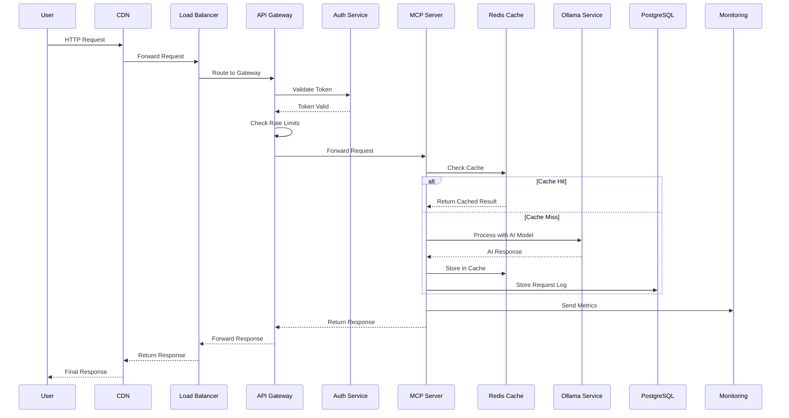
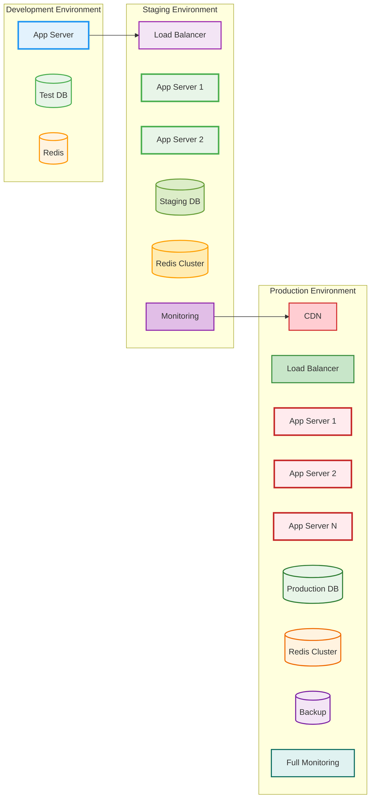
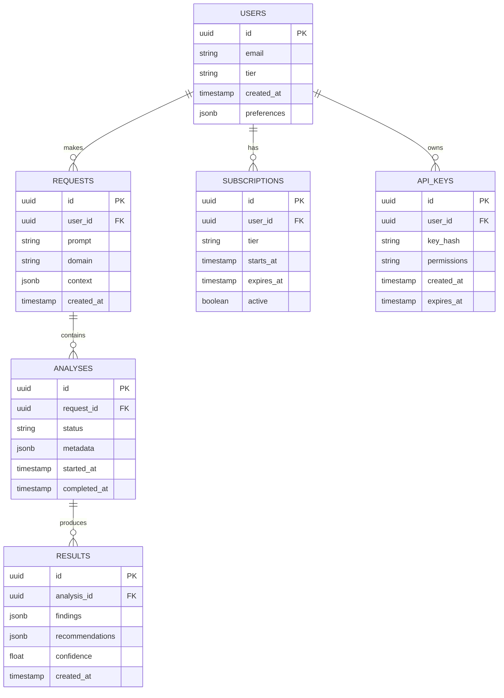
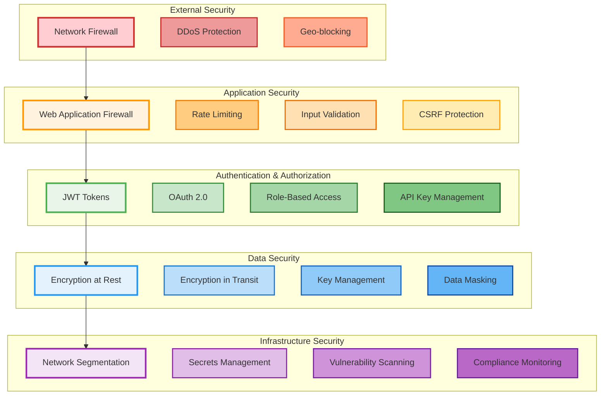
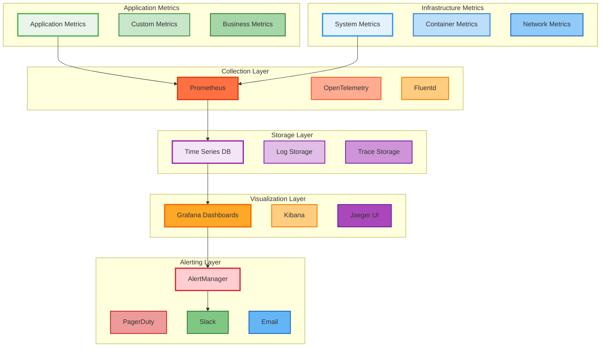

# System Architecture - InfraGenius

## 🏗️ Architecture Overview

InfraGenius follows a modern, cloud-native architecture designed for scalability, reliability, and maintainability. The system is built using microservices principles with clear separation of concerns.

## 🎯 System Architecture Diagram

```mermaid
graph TB
    subgraph "External Users"
        DEV[Developers]
        SRE[SRE Engineers]
        OPS[DevOps Teams]
        PLATFORM[Platform Engineers]
    end

    subgraph "Client Layer"
        WEB[Web Interface]
        CLI[CLI Tool]
        API_CLIENT[API Clients]
        MOBILE[Mobile App]
    end

    subgraph "Edge Layer"
        CDN[CloudFront/CDN]
        WAF[Web Application Firewall]
        LB[Load Balancer]
    end

    subgraph "API Gateway Layer"
        GATEWAY[API Gateway]
        AUTH[Authentication Service]
        RATE[Rate Limiting]
        CORS[CORS Handler]
    end

    subgraph "Application Layer"
        MCP1[MCP Server Instance 1]
        MCP2[MCP Server Instance 2]
        MCP3[MCP Server Instance N]
        
        subgraph "Core Services"
            ANALYSIS[Analysis Engine]
            PROMPT[Prompt Processor]
            CACHE_SVC[Cache Service]
            USER_SVC[User Service]
        end
    end

    subgraph "AI/ML Layer"
        OLLAMA[Ollama Service]
        MODEL_STORE[Model Storage]
        FINE_TUNE[Fine-tuning Service]
        
        subgraph "Models"
            GPT_OSS[GPT-OSS Model]
            DEVOPS_MODEL[DevOps Specialist]
            SRE_MODEL[SRE Specialist]
            CLOUD_MODEL[Cloud Specialist]
        end
    end

    subgraph "Data Layer"
        subgraph "Primary Storage"
            POSTGRES[(PostgreSQL)]
            REDIS[(Redis Cluster)]
        end
        
        subgraph "Object Storage"
            S3[(S3/Object Store)]
            BACKUP[(Backup Storage)]
        end
        
        subgraph "Search & Analytics"
            ELASTIC[Elasticsearch]
            ANALYTICS[Analytics DB]
        end
    end

    subgraph "Infrastructure Layer"
        subgraph "Container Platform"
            K8S[Kubernetes]
            DOCKER[Docker]
        end
        
        subgraph "Cloud Providers"
            AWS[Amazon Web Services]
            GCP[Google Cloud Platform]
            AZURE[Microsoft Azure]
        end
    end

    subgraph "Observability Layer"
        subgraph "Metrics & Monitoring"
            PROMETHEUS[Prometheus]
            GRAFANA[Grafana]
            ALERTMANAGER[AlertManager]
        end
        
        subgraph "Logging & Tracing"
            LOKI[Loki/ELK]
            JAEGER[Jaeger]
            OPENTELEMETRY[OpenTelemetry]
        end
    end

    subgraph "Security Layer"
        VAULT[HashiCorp Vault]
        CERT_MANAGER[Cert Manager]
        NETWORK_POLICY[Network Policies]
        RBAC[RBAC]
    end

    %% Connections
    DEV --> WEB
    SRE --> CLI
    OPS --> API_CLIENT
    PLATFORM --> MOBILE

    WEB --> CDN
    CLI --> CDN
    API_CLIENT --> CDN
    MOBILE --> CDN

    CDN --> WAF
    WAF --> LB
    LB --> GATEWAY

    GATEWAY --> AUTH
    GATEWAY --> RATE
    GATEWAY --> CORS
    
    AUTH --> MCP1
    AUTH --> MCP2
    AUTH --> MCP3

    MCP1 --> ANALYSIS
    MCP2 --> PROMPT
    MCP3 --> CACHE_SVC

    ANALYSIS --> OLLAMA
    PROMPT --> GPT_OSS
    OLLAMA --> MODEL_STORE

    MCP1 --> POSTGRES
    MCP2 --> REDIS
    MCP3 --> S3

    K8S --> AWS
    K8S --> GCP
    K8S --> AZURE

    MCP1 --> PROMETHEUS
    MCP2 --> LOKI
    MCP3 --> JAEGER

    %% User Types
    style DEV fill:#2196f3,stroke:#1976d2,stroke-width:2px,color:#fff
    style SRE fill:#4caf50,stroke:#388e3c,stroke-width:2px,color:#fff
    style OPS fill:#ff9800,stroke:#f57c00,stroke-width:2px,color:#fff
    style PLATFORM fill:#9c27b0,stroke:#7b1fa2,stroke-width:2px,color:#fff
    
    %% Client Layer
    style WEB fill:#e3f2fd,stroke:#2196f3,stroke-width:2px
    style CLI fill:#e8f5e8,stroke:#4caf50,stroke-width:2px
    style API_CLIENT fill:#fff3e0,stroke:#ff9800,stroke-width:2px
    style MOBILE fill:#f3e5f5,stroke:#9c27b0,stroke-width:2px
    
    %% Edge Layer
    style CDN fill:#ffecb3,stroke:#ffa000,stroke-width:2px
    style WAF fill:#ffcdd2,stroke:#d32f2f,stroke-width:2px
    style LB fill:#dcedc8,stroke:#689f38,stroke-width:2px
    
    %% API Gateway
    style GATEWAY fill:#e1bee7,stroke:#8e24aa,stroke-width:2px
    style AUTH fill:#ffab91,stroke:#ff5722,stroke-width:2px
    style RATE fill:#80cbc4,stroke:#00695c,stroke-width:2px
    style CORS fill:#c5e1a5,stroke:#558b2f,stroke-width:2px
    
    %% Application Layer
    style MCP1 fill:#90caf9,stroke:#1976d2,stroke-width:2px
    style MCP2 fill:#a5d6a7,stroke:#388e3c,stroke-width:2px
    style MCP3 fill:#ffcc80,stroke:#f57c00,stroke-width:2px
    
    %% AI/ML Layer
    style OLLAMA fill:#ce93d8,stroke:#7b1fa2,stroke-width:2px
    style MODEL_STORE fill:#f8bbd9,stroke:#c2185b,stroke-width:2px
    style FINE_TUNE fill:#b39ddb,stroke:#512da8,stroke-width:2px
    
    %% Data Layer
    style POSTGRES fill:#81c784,stroke:#2e7d32,stroke-width:2px
    style REDIS fill:#ef5350,stroke:#c62828,stroke-width:2px
    style S3 fill:#ffb74d,stroke:#ef6c00,stroke-width:2px
    
    %% Infrastructure
    style K8S fill:#42a5f5,stroke:#1565c0,stroke-width:2px
    style DOCKER fill:#29b6f6,stroke:#0277bd,stroke-width:2px
    style AWS fill:#ffa726,stroke:#e65100,stroke-width:2px
    style GCP fill:#66bb6a,stroke:#2e7d32,stroke-width:2px
    style AZURE fill:#5c6bc0,stroke:#303f9f,stroke-width:2px
    
    %% Monitoring
    style PROMETHEUS fill:#ff7043,stroke:#d84315,stroke-width:2px
    style GRAFANA fill:#ffa726,stroke:#ef6c00,stroke-width:2px
    style JAEGER fill:#ab47bc,stroke:#6a1b9a,stroke-width:2px
```



## 🔄 Request Flow Architecture



## 🏢 Multi-Environment Architecture



## 🎯 Component Architecture

### Core Components

#### 1. MCP Server Core
```python
# Core server structure
class MCPServer:
    - authentication_handler: AuthHandler
    - rate_limiter: RateLimiter
    - analysis_engine: AnalysisEngine
    - cache_manager: CacheManager
    - monitoring: MonitoringService
```

#### 2. Analysis Engine
```python
class AnalysisEngine:
    - domain_processors: Dict[str, DomainProcessor]
    - model_manager: ModelManager
    - context_processor: ContextProcessor
    - result_formatter: ResultFormatter
```

#### 3. Domain Processors
```python
# Specialized processors for each domain
- DevOpsProcessor: CI/CD, Infrastructure, Automation
- SREProcessor: Reliability, Incidents, SLOs
- CloudProcessor: Architecture, Security, Cost
- PlatformProcessor: Developer Experience, APIs
```

### Data Architecture

#### Database Schema


## 🔐 Security Architecture



## 📊 Monitoring Architecture



## 🌍 Multi-Cloud Deployment Architecture



```mermaid
graph TB
    subgraph "Global Load Balancer"
        GLB[Global Load Balancer]
        DNS[Route53/Cloud DNS]
        HEALTH[Health Checks]
    end

    subgraph "AWS Region"
        AWS_LB[ALB]
        AWS_EKS[EKS Cluster]
        AWS_RDS[RDS PostgreSQL]
        AWS_REDIS[ElastiCache]
        AWS_S3[S3 Storage]
    end

    subgraph "GCP Region"
        GCP_LB[Cloud Load Balancer]
        GCP_GKE[GKE Cluster]
        GCP_SQL[Cloud SQL]
        GCP_REDIS[Memorystore]
        GCP_STORAGE[Cloud Storage]
    end

    subgraph "Azure Region"
        AZURE_LB[Azure Load Balancer]
        AZURE_AKS[AKS Cluster]
        AZURE_SQL[Azure Database]
        AZURE_REDIS[Azure Cache]
        AZURE_STORAGE[Blob Storage]
    end

    GLB --> AWS_LB
    GLB --> GCP_LB
    GLB --> AZURE_LB

    AWS_LB --> AWS_EKS
    GCP_LB --> GCP_GKE
    AZURE_LB --> AZURE_AKS
    
    %% Global Load Balancer
    style GLB fill:#ffcdd2,stroke:#d32f2f,stroke-width:3px
    style DNS fill:#f8bbd9,stroke:#c2185b,stroke-width:2px
    style HEALTH fill:#ffab91,stroke:#ff5722,stroke-width:2px
    
    %% AWS Region
    style AWS_LB fill:#ffa726,stroke:#e65100,stroke-width:3px
    style AWS_EKS fill:#ffcc80,stroke:#f57c00,stroke-width:2px
    style AWS_RDS fill:#ffe0b2,stroke:#ef6c00,stroke-width:2px
    style AWS_REDIS fill:#ffecb3,stroke:#ffa000,stroke-width:2px
    style AWS_S3 fill:#fff3e0,stroke:#ff9800,stroke-width:2px
    
    %% GCP Region
    style GCP_LB fill:#66bb6a,stroke:#2e7d32,stroke-width:3px
    style GCP_GKE fill:#81c784,stroke:#388e3c,stroke-width:2px
    style GCP_SQL fill:#a5d6a7,stroke:#4caf50,stroke-width:2px
    style GCP_REDIS fill:#c8e6c9,stroke:#689f38,stroke-width:2px
    style GCP_STORAGE fill:#e8f5e8,stroke:#558b2f,stroke-width:2px
    
    %% Azure Region
    style AZURE_LB fill:#5c6bc0,stroke:#303f9f,stroke-width:3px
    style AZURE_AKS fill:#7986cb,stroke:#3f51b5,stroke-width:2px
    style AZURE_SQL fill:#9fa8da,stroke:#3949ab,stroke-width:2px
    style AZURE_REDIS fill:#c5cae9,stroke:#1976d2,stroke-width:2px
    style AZURE_STORAGE fill:#e8eaf6,stroke:#1565c0,stroke-width:2px
```

## 🚀 Deployment Pipeline Architecture

```mermaid
graph LR
    subgraph "Source Control"
        GIT[Git Repository]
        PR[Pull Request]
        MERGE[Merge to Main]
    end

    subgraph "CI/CD Pipeline"
        BUILD[Build & Test]
        SECURITY[Security Scan]
        PACKAGE[Package Image]
        DEPLOY_TEST[Deploy to Test]
        INTEGRATION[Integration Tests]
        DEPLOY_STAGE[Deploy to Staging]
        E2E[E2E Tests]
        DEPLOY_PROD[Deploy to Production]
    end

    subgraph "Environments"
        TEST_ENV[Test Environment]
        STAGE_ENV[Staging Environment]
        PROD_ENV[Production Environment]
    end

    GIT --> BUILD
    BUILD --> SECURITY
    SECURITY --> PACKAGE
    PACKAGE --> DEPLOY_TEST
    DEPLOY_TEST --> TEST_ENV
    TEST_ENV --> INTEGRATION
    INTEGRATION --> DEPLOY_STAGE
    DEPLOY_STAGE --> STAGE_ENV
    STAGE_ENV --> E2E
    E2E --> DEPLOY_PROD
    DEPLOY_PROD --> PROD_ENV
    
    %% Source Control
    style GIT fill:#e8f5e8,stroke:#4caf50,stroke-width:3px
    style PR fill:#c8e6c9,stroke:#388e3c,stroke-width:2px
    style MERGE fill:#a5d6a7,stroke:#2e7d32,stroke-width:2px
    
    %% CI/CD Pipeline
    style BUILD fill:#e3f2fd,stroke:#2196f3,stroke-width:3px
    style SECURITY fill:#ffcdd2,stroke:#d32f2f,stroke-width:2px
    style PACKAGE fill:#fff3e0,stroke:#ff9800,stroke-width:2px
    style DEPLOY_TEST fill:#e1f5fe,stroke:#0277bd,stroke-width:2px
    style INTEGRATION fill:#e0f2f1,stroke:#00695c,stroke-width:2px
    style DEPLOY_STAGE fill:#f3e5f5,stroke:#8e24aa,stroke-width:2px
    style E2E fill:#fce4ec,stroke:#c2185b,stroke-width:2px
    style DEPLOY_PROD fill:#ffebee,stroke:#c62828,stroke-width:2px
    
    %% Environments
    style TEST_ENV fill:#e8f5e8,stroke:#4caf50,stroke-width:3px
    style STAGE_ENV fill:#fff3e0,stroke:#ff9800,stroke-width:3px
    style PROD_ENV fill:#ffebee,stroke:#f44336,stroke-width:3px
```



## 📈 Scaling Strategy

### Horizontal Scaling
- **Application Servers**: Auto-scaling based on CPU/memory
- **Database**: Read replicas and connection pooling
- **Cache**: Redis cluster with sharding
- **Load Balancers**: Multiple instances across regions

### Vertical Scaling
- **CPU**: Scale up for compute-intensive AI processing
- **Memory**: Increase for model caching and data processing
- **Storage**: Expand for growing data and model storage

### Geographic Scaling
- **Multi-region deployment** for reduced latency
- **Edge caching** for static content
- **Data replication** across regions for disaster recovery

## 🔧 Technology Stack

### Backend
- **Language**: Python 3.11+
- **Framework**: FastAPI
- **AI/ML**: Ollama, Transformers
- **Database**: PostgreSQL 15+
- **Cache**: Redis 7+
- **Message Queue**: Redis/RabbitMQ

### Frontend
- **Framework**: React/Next.js
- **UI Library**: Material-UI/Tailwind
- **State Management**: Redux/Zustand
- **Build Tool**: Vite/Webpack

### Infrastructure
- **Containers**: Docker
- **Orchestration**: Kubernetes
- **Cloud**: AWS, GCP, Azure
- **IaC**: Terraform, Helm
- **CI/CD**: GitHub Actions, GitLab CI

### Monitoring
- **Metrics**: Prometheus, Grafana
- **Logging**: ELK Stack, Loki
- **Tracing**: Jaeger, OpenTelemetry
- **APM**: Sentry, DataDog

## 🎯 Performance Characteristics

### Latency Targets
- **API Response**: < 1 second (95th percentile)
- **AI Processing**: < 5 seconds (average)
- **Cache Hit**: < 10ms
- **Database Query**: < 100ms

### Throughput Targets
- **Concurrent Users**: 10,000+
- **Requests per Second**: 1,000+
- **AI Analyses per Hour**: 100,000+

### Availability Targets
- **Uptime**: 99.9% (8.76 hours downtime/year)
- **Recovery Time**: < 5 minutes
- **Recovery Point**: < 15 minutes
- **Error Rate**: < 0.1%

This architecture provides a solid foundation for a scalable, reliable, and maintainable DevOps/SRE MCP Server that can grow with user demand and business requirements.
