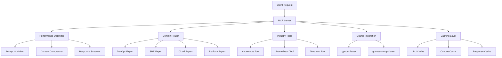

# DevOps/SRE/Cloud/Platform Engineering MCP Server

Advanced Model Context Protocol (MCP) Server optimized for DevOps, Site Reliability Engineering (SRE), Cloud Architecture, and Platform Engineering with industry-level expertise using the `gpt-oss:latest` model.

## 🎯 Overview

This MCP server provides comprehensive analysis and solutions for:

- **DevOps**: CI/CD pipelines, Infrastructure as Code, automation, monitoring
- **SRE**: Reliability engineering, incident response, SLO management, observability
- **Cloud Architecture**: Multi-cloud strategies, security, cost optimization, migration
- **Platform Engineering**: Developer experience, API design, self-service tools, internal platforms

## ✨ Key Features

### 🧠 Industry-Level Expertise
- **Fine-tuned Model**: Specialized `gpt-oss-devops:latest` model trained on domain-specific datasets
- **Multi-Domain Analysis**: Comprehensive coverage across all DevOps disciplines
- **Production-Ready Solutions**: Actionable recommendations with implementation details
- **Best Practices**: Industry standards and security considerations built-in

### 🚀 Performance Optimizations
- **Cursor AI Techniques**: Advanced prompt optimization and context compression
- **Intelligent Caching**: Multi-level caching with LRU and TTL strategies
- **Parallel Processing**: Concurrent analysis for improved throughput
- **Response Streaming**: Real-time response delivery for better UX
- **Memory Management**: Optimized resource usage and garbage collection

### 🛠️ Industry Tools Integration
- **Kubernetes**: Cluster management, pod analysis, resource monitoring
- **Prometheus**: Metrics collection, alerting, performance analysis
- **Terraform**: Infrastructure provisioning, state management, validation
- **Cloud Providers**: AWS, Azure, GCP native integrations
- **Monitoring Stack**: Grafana, ELK, Jaeger distributed tracing

### 🔒 Enterprise Security
- **SOC2 Compliance**: Built-in compliance checks and audit trails
- **Security Scanning**: Vulnerability detection and remediation
- **Access Controls**: Role-based access and authentication
- **Data Encryption**: End-to-end encryption at rest and in transit

## 🚀 Quick Start

### Prerequisites

```bash
# Install Ollama
curl -fsSL https://ollama.ai/install.sh | sh

# Pull the base model
ollama pull gpt-oss:latest

# Install Python dependencies
pip install -r requirements.txt
```

### Installation

```bash
# Clone the repository
git clone https://github.com/logify360/devops-sre-mcp-server.git
cd devops-sre-mcp-server

# Install the package
pip install -e .

# Or using Docker
docker build -t devops-mcp-server .
docker run -p 8000:8000 -p 11434:11434 devops-mcp-server
```

### Basic Usage

```bash
# Start the MCP server
python server.py

# Or with custom configuration
python server.py --config config.json
```

### Fine-Tuning (Optional)

```bash
# Fine-tune the model for your specific environment
python fine_tuning/fine_tune.py \
    --dataset fine_tuning/devops_dataset.jsonl \
    --output-model gpt-oss-devops:latest \
    --epochs 10
```

## 📋 Available Tools

### Log Analysis
```python
# Analyze system logs with domain expertise
result = await server.analyze_logs(
    logs="2025-01-15T10:30:15Z [ERROR] api-gateway: High response time detected",
    analysis_type="devops",
    context="Production Kubernetes cluster"
)
```

### Infrastructure Audit
```python
# Security and compliance audit
result = await server.infrastructure_audit(
    infrastructure_config=terraform_config,
    cloud_provider="aws",
    compliance_framework="soc2"
)
```

### Incident Analysis
```python
# Post-mortem analysis and recommendations
result = await server.incident_analysis(
    incident_data=incident_logs,
    severity="high",
    service_context="E-commerce platform"
)
```

### Performance Analysis
```python
# Performance bottleneck identification
result = await server.performance_analysis(
    metrics_data=prometheus_metrics,
    analysis_period="24h",
    service_name="api-gateway"
)
```

### Capacity Planning
```python
# Resource capacity planning
result = await server.capacity_planning(
    usage_data=resource_metrics,
    growth_projection="20%",
    time_horizon="6months"
)
```

### Security Assessment
```python
# Security threat analysis
result = await server.security_assessment(
    security_logs=security_events,
    threat_model="owasp",
    environment="production"
)
```

### Cost Optimization
```python
# Cloud cost optimization
result = await server.cost_optimization(
    cost_data=billing_data,
    optimization_target="30%",
    cloud_provider="aws"
)
```

### Disaster Recovery Planning
```python
# DR strategy and implementation
result = await server.disaster_recovery_plan(
    system_architecture=architecture_diagram,
    rto_requirement="4h",
    rpo_requirement="1h"
)
```

## 🔧 Configuration

### Server Configuration (`config.json`)

```json
{
  "server": {
    "name": "DevOps SRE Platform MCP Server",
    "model": "gpt-oss:latest",
    "performance_optimizations": {
      "enabled": true,
      "parallel_processing": true,
      "caching": true,
      "batch_processing": true
    }
  },
  "domains": {
    "devops": {
      "enabled": true,
      "expertise_level": "senior",
      "specializations": ["ci_cd", "infrastructure", "automation"]
    },
    "sre": {
      "enabled": true,
      "expertise_level": "principal",
      "specializations": ["reliability", "incident_response", "slo_management"]
    },
    "cloud": {
      "enabled": true,
      "expertise_level": "architect",
      "platforms": ["aws", "azure", "gcp"]
    },
    "platform": {
      "enabled": true,
      "expertise_level": "staff",
      "specializations": ["developer_experience", "api_design"]
    }
  }
}
```

### Fine-Tuning Configuration

```json
{
  "fine_tuning": {
    "base_model": "gpt-oss:latest",
    "output_model": "gpt-oss-devops:latest",
    "dataset_path": "./fine_tuning/devops_dataset.jsonl",
    "epochs": 10,
    "learning_rate": 0.0001,
    "batch_size": 8,
    "domain_weights": {
      "devops": 0.3,
      "sre": 0.25,
      "cloud": 0.25,
      "platform": 0.2
    }
  }
}
```

## 📊 Performance Metrics

The server includes comprehensive performance monitoring:

```python
# Get performance statistics
stats = server.get_performance_stats()
print(f"Cache Hit Rate: {stats['global_cache']['hit_rate']:.2%}")
print(f"Average Response Time: {stats['performance_summary']['avg_response_time']:.2f}s")
print(f"Success Rate: {stats['performance_summary']['success_rate']:.2%}")
```

### Key Metrics
- **Response Time**: P50, P95, P99 latency percentiles
- **Cache Performance**: Hit rates across all cache layers
- **Resource Usage**: Memory, CPU, and disk utilization
- **Error Rates**: Success/failure rates by operation type
- **Throughput**: Requests per second and concurrent operations

## 🏗️ Architecture



## 🧪 Testing

```bash
# Run unit tests
pytest tests/

# Run integration tests
pytest tests/integration/

# Run performance tests
pytest tests/performance/

# Run security tests
bandit -r .
safety check
```

## 📈 Monitoring and Observability

### Health Checks
```bash
curl http://localhost:8000/health
```

### Metrics Endpoint
```bash
curl http://localhost:8000/metrics
```

### Distributed Tracing
The server supports Jaeger tracing for comprehensive request tracking:

```bash
# Start Jaeger
docker run -d --name jaeger \
  -p 16686:16686 \
  -p 14268:14268 \
  jaegertracing/all-in-one:latest
```

## 🔐 Security

### Security Features
- **Input Validation**: Comprehensive input sanitization
- **Rate Limiting**: Configurable rate limits per client
- **Authentication**: JWT and API key authentication
- **Audit Logging**: Complete audit trail of all operations
- **Vulnerability Scanning**: Automated security scanning

### Security Configuration
```json
{
  "security": {
    "authentication": {
      "enabled": true,
      "methods": ["api_key", "jwt"]
    },
    "rate_limiting": {
      "enabled": true,
      "requests_per_minute": 100
    },
    "audit_logging": {
      "enabled": true,
      "retention_days": 90
    }
  }
}
```

## 🚀 Deployment

### Docker Deployment
```bash
# Build and run
docker build -t devops-mcp-server .
docker run -d \
  --name devops-mcp \
  -p 8000:8000 \
  -p 11434:11434 \
  -v $(pwd)/config.json:/app/config.json \
  devops-mcp-server
```

### Kubernetes Deployment
```yaml
apiVersion: apps/v1
kind: Deployment
metadata:
  name: devops-mcp-server
spec:
  replicas: 3
  selector:
    matchLabels:
      app: devops-mcp-server
  template:
    metadata:
      labels:
        app: devops-mcp-server
    spec:
      containers:
      - name: devops-mcp-server
        image: devops-mcp-server:latest
        ports:
        - containerPort: 8000
        resources:
          requests:
            memory: "2Gi"
            cpu: "1000m"
          limits:
            memory: "4Gi"
            cpu: "2000m"
        env:
        - name: ENVIRONMENT
          value: "production"
        - name: LOG_LEVEL
          value: "info"
```

### Production Considerations
- **Resource Requirements**: 4GB RAM minimum, 8GB recommended
- **CPU**: 2+ cores for optimal performance
- **Storage**: 10GB+ for models and cache
- **Network**: Low latency connection to Ollama service
- **Monitoring**: Prometheus metrics and Grafana dashboards
- **Backup**: Regular backup of fine-tuned models and configuration

## 📚 Examples

### DevOps Pipeline Analysis
```python
pipeline_logs = """
2025-01-15T10:30:15Z [INFO] Starting CI/CD pipeline for microservice-api
2025-01-15T10:30:20Z [INFO] Running unit tests... PASSED
2025-01-15T10:30:25Z [ERROR] Security scan failed: High severity vulnerability detected
2025-01-15T10:30:26Z [INFO] Pipeline stopped due to security gate failure
"""

result = await server.analyze_logs(
    logs=pipeline_logs,
    analysis_type="devops",
    context="Microservices CI/CD pipeline"
)

print(result['recommendations'])
# Output: Detailed security recommendations and pipeline improvements
```

### SRE Incident Response
```python
incident_data = """
2025-01-15T10:30:00Z [CRITICAL] API Gateway: Response time exceeded 5s
2025-01-15T10:30:05Z [ERROR] Database: Connection pool exhausted
2025-01-15T10:30:10Z [WARN] Load Balancer: Health check failures increasing
2025-01-15T10:30:15Z [INFO] Auto-scaling triggered: Adding 3 instances
"""

result = await server.incident_analysis(
    incident_data=incident_data,
    severity="critical",
    service_context="E-commerce API"
)

print(result['root_causes'])
print(result['action_items'])
# Output: Comprehensive incident analysis with timeline and action items
```

### Cloud Cost Optimization
```python
cost_data = """
Monthly AWS Bill: $15,000
EC2 Instances: $8,000 (60% utilization)
RDS Databases: $3,000 (40% utilization)
Data Transfer: $2,000
Storage: $1,500
Other Services: $500
"""

result = await server.cost_optimization(
    cost_data=cost_data,
    optimization_target="30%",
    cloud_provider="aws"
)

print(result['optimization_opportunities'])
# Output: Specific cost reduction strategies with projected savings
```

## 🤝 Contributing

We welcome contributions! Please see our [Contributing Guide](CONTRIBUTING.md) for details.

### Development Setup
```bash
# Clone repository
git clone https://github.com/logify360/devops-sre-mcp-server.git
cd devops-sre-mcp-server

# Create virtual environment
python -m venv venv
source venv/bin/activate  # or `venv\Scripts\activate` on Windows

# Install development dependencies
pip install -e ".[dev]"

# Install pre-commit hooks
pre-commit install

# Run tests
pytest
```

## 📄 License

This project is licensed under the MIT License - see the [LICENSE](LICENSE) file for details.

## 🆘 Support

- **Documentation**: [Full Documentation](https://docs.logify360.com/mcp-server)
- **Issues**: [GitHub Issues](https://github.com/logify360/devops-sre-mcp-server/issues)
- **Discord**: [Join our community](https://discord.gg/logify360)
- **Email**: support@logify360.com

## 🙏 Acknowledgments

- **Ollama Team**: For the excellent local LLM infrastructure
- **MCP Protocol**: For the standardized model communication protocol
- **DevOps Community**: For the valuable feedback and contributions
- **Open Source Contributors**: Thank you for making this project possible

---

**Built with ❤️ by the Logify360 DevOps Team**
